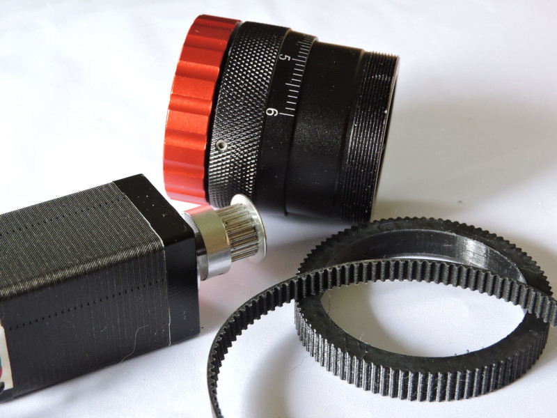

# ASCOM driver for a helical motor focuser

This ASCOM driver is for a stepper motor based helical focuser. The motor drives the focuser via a timing belt. The focuser itself is extended with a 3D printed toothed belt wheel. For my prototype I use the ZWO Helical Focuser 1.25'' with T thread.
Motor used: NEMA 11 Stepper motor, 52mm length, 200 steps and 5mm shaft.
Belt: GT2 with 125 teeth.
Control electronic: Arduino Uno with CNC shield. 
Stepper driver: TMC2130, standalone mode with 16µ steps, interpolated to 256µ steps.

The Arduino and the CNC shield are 12V powered, the stepper is connected to the Y driver.

