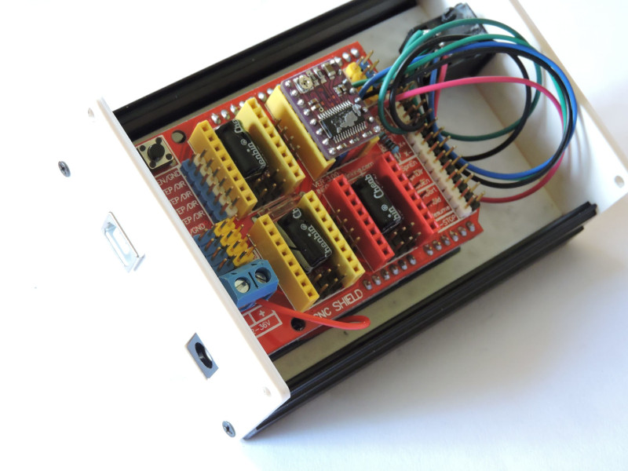
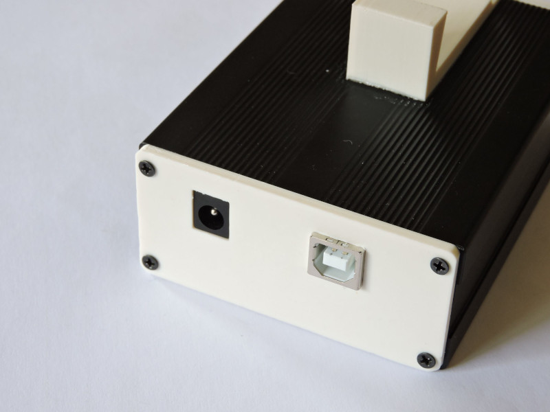

# ASCOM driver for a helical motor focuser

This ASCOM driver is for a stepper motor based helical focuser. The motor drives the focuser via a timing belt. The focuser itself is extended with a 3D printed toothed belt wheel. For my prototype I use the ZWO Helical Focuser 1.25'' with T thread.


Motor used: NEMA 11 Stepper motor, 52mm length, 200 steps and 5mm shaft.

Belt: GT2 with 125 teeth.

Control electronic: Arduino Uno with CNC shield. 

Stepper driver: TMC2130, standalone mode with 16µ steps, interpolated to 256µ steps.


The Arduino and the CNC shield are 12V powered, the stepper is connected to the Y driver.



Arduino Uno based controler. Firmware for this setup is part of this repo.



Robust alu housing, sitting on a GP dovetail (via 3D printed mount).

The focus motor is controlled via a simple serial protocol, 9600 baud:

```
Command         Response        Description
-----------------------------------------------------------------------------
ID:             FOCUSER#        Device identification
TRxxx:          1#              Move right xxx steps
TLxxx:          1#              Move left xxx steps
ST:             1#              Stop the current movement
MV:             0# or 1#        #1: Rotator is moving, otherwise 0#
MOFF:           1#              The motor is disabled after movement
MON:            1#              The motor is always powerd
PO:             xxxx#           The (relative) position is reported
```

After powerup the focuser does not move, the position is reportet as 0 and it can be moved between to negative (left) or positive (right) direction. The firmware does not restrict the amount of movement. 

For usage with the PHD2 guiding software a ASCOM focuser client application is added into this repository. 

